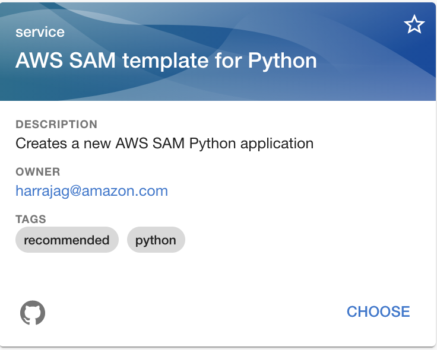

# Scaff folding template for AWS SAM application

## Overview

Scaffolding template for backstage to create AWS SAM based serverless application using python. The Software Templates part of Backstage is a tool that can help you create Components inside Backstage. By default, it has the ability to load skeletons of code, template in some variables, and then publish the template to some locations like GitHub or GitLab.

## Installation

1. Login to the local backstage instance using this [URL](http://localhost:3000/create)
2. Click on **Register Existing Component** button
3. Enter the following github URL for **template.yaml** provided in the root directory. [https://github.com/hariohmprasath/backstage-aws-sam-app-python/blob/master/template.yaml](https://github.com/hariohmprasath/backstage-aws-sam-app-python/blob/master/template.yaml)
4. Click on **Analyze** button
5. Review all the information presented and click on **Import** button, this will complete the registration process.
6. Now going back if we go back to the **Create Component** page using this [URL](http://localhost:3000/create), we should see the newly registered component, like below:


## Usage

Now lets create a new application using the registered component.

1. Login to the local backstage instance using this [URL](http://localhost:3000/create)
2. Click on the **Choose** button under **AWS SAM template for Python**
3. Fill in the following details:
    - **component_id** - Unique name of the component
    - **name of the project** - Name of the application
    - **include safe deployment**(optional) - Sends by default 10% of traffic for every 1 minute to a newly deployed function using CodeDeploy + SAM integration - Linear10PercentEvery1Minute
    - **region** - AWS Region in which the application will be deployed
4. Click on **Next** button
5. Fill in the following details:
    - **Owner** - Owner of the github repository.
    - **Repository** - Name of the github repository.
6. Click on **Next** button.
7. Review all the details and click on **Create** button, this should take care of fetching the required files, apply cookie cutter pattern and push the modified contents to the specified github repository.
8. Click on the **Repo** hyperlink to navigate to the newly created github repository.

## Deployment

Code repository uses Github actions to deploy the sam application to AWS. So we need to specify the AWS credentials in the form of Github secrets. Here is a step by step guide to specify the secrets:

1. Click on **Settings** menu and click on **Secrets** sidebar.
2. Click on **New repository secret** button and enter the following details:
    - **AWS_ACCESS_KEY_ID** - AWS Access Key ID
    - **AWS_SECRET_ACCESS_KEY** - AWS Secret Access Key
3. Click on **Actions** menu, naviate to `.github/workflows/deploy.yml` file and click on **Run workflow** button to launch the action.
4. This should automatically deploy the application to AWS, here is the sample cloudformation output, you can see in the Github actions

```bash
CloudFormation outputs from deployed stack
-------------------------------------------------------------------------------------------------
Outputs                                                                                         
-------------------------------------------------------------------------------------------------
Key                 HelloWorldApigwURL                                                          
Description         API Gateway endpoint URL for Prod environment for Hello World Function      
Value               https://xxyyzz.execute-api.us-east-2.amazonaws.com/Prod/hello           

Key                 HelloWorldFunction                                                          
Description         Hello World Lambda Function ARN                                             
Value               arn:aws:lambda:us-east-2:***:function:customer-service-            
HelloWorldFunction-ItvhbCd8EjYQ                                                                 
-------------------------------------------------------------------------------------------------
```

## Resources

- [Backstage](https://backstage.io)
- [Adding new template backstage](https://backstage.io/docs/features/software-templates/adding-templates)
- [AWS SAM](https://aws.amazon.com/blogs/compute/introducing-serverless-architecture-aws-sam/)
- [Github Actions](https://help.github.com/en/actions/automating-your-workflow-with-github-actions/)